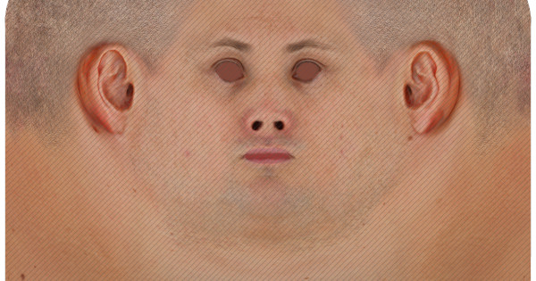

<p align="center">
  
</p>

<div align="center">
  <table style="border: 1px solid #ccc; border-radius: 15px; padding: 20px; background: #f9f9f9; display: inline-block;">
    <tr><td>

### 🤖 Projeto: Robo OpenGL 

Este projeto é um robô 3D animado com textura e controle por teclado usando OpenGL e SOIL.

**Plataforma:** C++ com OpenGL + GLUT  
**Recursos:** Texturas, Animações, Iluminação  
**Controles:** W / A / S / D para movimentação

  </td></tr>
  </table>
</div>

## ✅ Pré-requisitos

Antes de compilar e rodar o projeto, você precisa ter:

- [OpenGL](https://www.opengl.org/)
- [GLUT](https://www.opengl.org/resources/libraries/glut/)
- [SOIL (Simple OpenGL Image Library)](https://www.lonesock.net/soil.html)
- Um compilador C++ (como `g++`)

### No Ubuntu/Debian, você pode instalar as dependências com:

```bash
sudo apt-get update
sudo apt-get install g++ freeglut3-dev libsoil-dev
```

## 🚀 Como rodar

1. Clone este repositório ou baixe os arquivos:

```bash
git clone https://github.com/seuusuario/robo-opengl.git
cd robo-opengl
```

2. Compile o código:

```bash
g++ robo_opengl.cpp -o robo -lGL -lGLU -lglut -lSOIL
```

3. Execute:

```bash
./robo
```

> **Nota:** Certifique-se de que a pasta `textures/` esteja no mesmo diretório que o executável, contendo os arquivos `metal.jpeg` e `face.jpg`.

## 🎮 Controles

- `W` – Move o robô para frente  
- `S` – Move o robô para trás  
- `A` – Gira o robô para a esquerda  
- `D` – Gira o robô para a direita  

## 🧠 O que esperar

- Um robô 3D com corpo, cabeça, braços e pernas
- Texturas aplicadas nas superfícies (corpo metálico e rosto)
- Cabeça girando constantemente
- Braços e pernas se movendo animadamente
- Controle total do movimento usando o teclado
- Câmera posicionada para acompanhar o robô

## 📁 Estrutura do Projeto

```
robo-opengl/
├── robo_opengl.cpp
├── textures/
│   ├── metal.jpeg
│   └── face.jpg
└── README.md
```

## 🛠 Sugestões Futuras

- Adicionar sons ao movimento
- Inserir cenário e obstáculos
- Iluminação mais avançada (sombreamento dinâmico)
- Exportar o robô para outras engines (como Unity ou Unreal)

## 📄 Licença

Este projeto está sob a licença MIT. Sinta-se livre para usá-lo e modificá-lo!

---

Feito com 💙 por [Davison Tavares]
